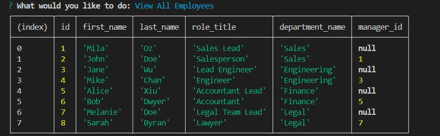

# employee-tracker
This Node.js application manages a company’s employee database, allowing users to view and update departments, roles, and employee details using PostgreSQL and Node.js   

    
   

# Video Demonstration
https://drive.google.com/file/d/1Mitvsbff02zR0tk8QtSwc275_xdMmMXT/view?usp=sharing

# Commands to run
psql -U postgres  
\i db/schema.sql  
\i db/seed.sql  
\q  
node index.js  

# Technologies Used
Node.js  Inquirer.js  PostgreSQL  pg to interact with the PostgreSQL database  npm  JavaScript  SQL  Visual Studio Code  GitHub 